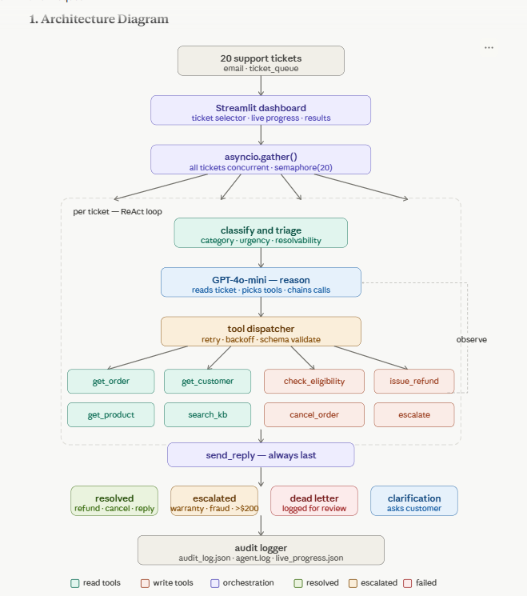

# 🤖 ShopWave Autonomous Support Agent

> **Ksolves Agentic AI Hackathon 2026** — Not a demo. Not a toy. Something real.


---

## 🚀 Live Demo

**[➡️ Try the Live App](https://shopwave-agent.streamlit.app/)**

> Select tickets → Run Agent → Watch AI resolve them in real time

---

## 🧠 What This Is

An autonomous AI agent that resolves ShopWave customer support tickets **end-to-end** — no humans needed for standard cases.

Built with a **ReAct (Reason → Act → Observe → Repeat)** loop using GPT-4o-mini, concurrent async processing, and a live Streamlit dashboard.

```
Customer Ticket → Classify → ReAct Loop → Tool Calls → Reply/Escalate → Audit Log
```

---

## ⚡ Quick Start

```bash
# 1. Clone
git clone https://github.com/ankit-0134/shopwave-agent
cd shopwave-agent

# 2. Install
pip install -r requirements.txt

# 3. Add API key
echo "OPENAI_API_KEY=your-key-here" > .env

# 4. Run
streamlit run app.py
```

---

## 🎯 How It Works

```
1. Select tickets from the dashboard
2. Agent classifies each → urgency · category · resolvability
3. ReAct loop fires — minimum 3 tool calls per ticket
4. All tickets processed CONCURRENTLY via asyncio.gather()
5. Live sidebar shows real-time progress
6. Final reply sent to customer + full audit trail saved
```

---

## 🛠️ Tech Stack

| Layer | Technology |
|-------|-----------|
| Language | Python 3.11 |
| LLM | OpenAI GPT-4o-mini |
| Orchestration | Custom async ReAct loop |
| Concurrency | asyncio.gather() — all tickets concurrent |
| UI | Streamlit |
| Logging | Python logging + audit_log.json |

---

## 📁 Project Structure

```
shopwave-agent/
├── app.py                  # ← Entry point (Streamlit dashboard)
├── main.py                 # CLI runner
├── agent/
│   └── agent_loop.py       # ReAct loop + tool dispatcher + classifier
├── tools/
│   └── mock_tools.py       # 8 mock tools with realistic failures
├── logger/
│   └── audit_logger.py     # Full audit trail per ticket
├── mocks/
│   ├── tickets.json        # 20 support tickets
│   ├── orders.json
│   ├── customers.json
│   ├── products.json
│   └── knowledge-base.md
├── architecture.png        # Agent architecture diagram
├── failure_modes.md        # 5 failure scenarios documented
├── demo.mp4                # Demo video - all 20 tickets processed
├── requirements.txt
└── README.md
```

---

## 🎫 What The Agent Handles

| Ticket Type | Action |
|-------------|--------|
| 💰 Refund request | Check eligibility → issue refund |
| 📦 Return request | Verify window → approve/decline |
| 🚫 Cancellation | Check status → cancel if processing |
| 🔄 Wrong item | Arrange exchange or refund |
| 🔧 Warranty/defect | Escalate to warranty team |
| 💥 Damaged on arrival | Full refund, no return needed |
| ❓ Ambiguous request | Ask clarifying questions |
| 🕵️ Fraud/social engineering | Flag and escalate high priority |

---

## ✨ Key Features

- **Concurrent processing** — all tickets fire simultaneously via asyncio.gather()
- **ReAct loop** — minimum 3 tool calls per ticket, never a black box
- **Graceful failure handling** — exponential backoff on tool timeouts
- **Dead letter queue** — failed tickets logged, never silently dropped
- **Schema validation** — tool outputs validated before acting
- **Full audit trail** — every tool call, reasoning step, and outcome logged
- **Live dashboard** — real-time per-ticket progress in sidebar
- **Download logs** — audit_log.json downloadable after every run

---

## 🔧 Tools

**Read / Lookup**
- get_order() — order details, status, timestamps
- get_customer() — customer profile, tier, history
- get_product() — product metadata, warranty, return window
- search_knowledge_base() — policy and FAQ semantic search

**Write / Act**
- check_refund_eligibility() — must be called before refund
- issue_refund() — irreversible, gated by eligibility check
- cancel_order() — only works on processing status orders
- send_reply() — always the final step
- escalate() — routes to human with full context

---

## ⚠️ Failure Modes

5 failure scenarios documented in failure_modes.md:

| Failure | Recovery |
|---------|----------|
| Tool timeout | Exponential backoff → escalate after 3 fails |
| Malformed response | Conservative defaults → log warning |
| Social engineering | Tier mismatch detection → flag + escalate |
| Order not found | Ask customer for clarification |
| LLM API failure | Dead-letter queue → other tickets unaffected |

---

## 🏗️ Architecture



---

*Built for Ksolves En(AI)bling Hackathon 2026 — "The world has enough chatbots. We are here to build agents."*